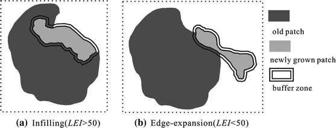
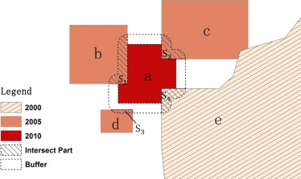

# Urban Expansion Index

These are a some tools used for calculate urban expansion index, now it only includes LEI, PEI, MLEI in Arcpy.

## LEI

Liu, X., Li, X., Chen, Y., Tan, Z., Li, S., Ai, B., 2010. A new landscape index for quantifying urban expansion using multi-temporal remotely sensed data. Landscape Ecol 25, 671–682. https://doi.org/10.1007/s10980-010-9454-5

## MLEI

Jiao, L., Mao, L., Liu, Y., 2015. Multi-order Landscape Expansion Index: Characterizing urban expansion dynamics. Landscape and Urban Planning 137, 30–39. https://doi.org/10.1016/j.landurbplan.2014.10.023

## PEI

Jiao, L., Liu, J., Xu, G., Dong, T., Gu, Y., Zhang, B., Liu, Y., Liu, X., 2018. Proximity Expansion Index: An improved approach to characterize evolution process of urban expansion. Computers, Environment and Urban Systems 70, 102–112. https://doi.org/10.1016/j.compenvurbsys.2018.02.005

## TODO

- [ ] Use R or python with rgeos or shapely
- [ ] Use google earth engine 
- [ ] Sample project in jupyter